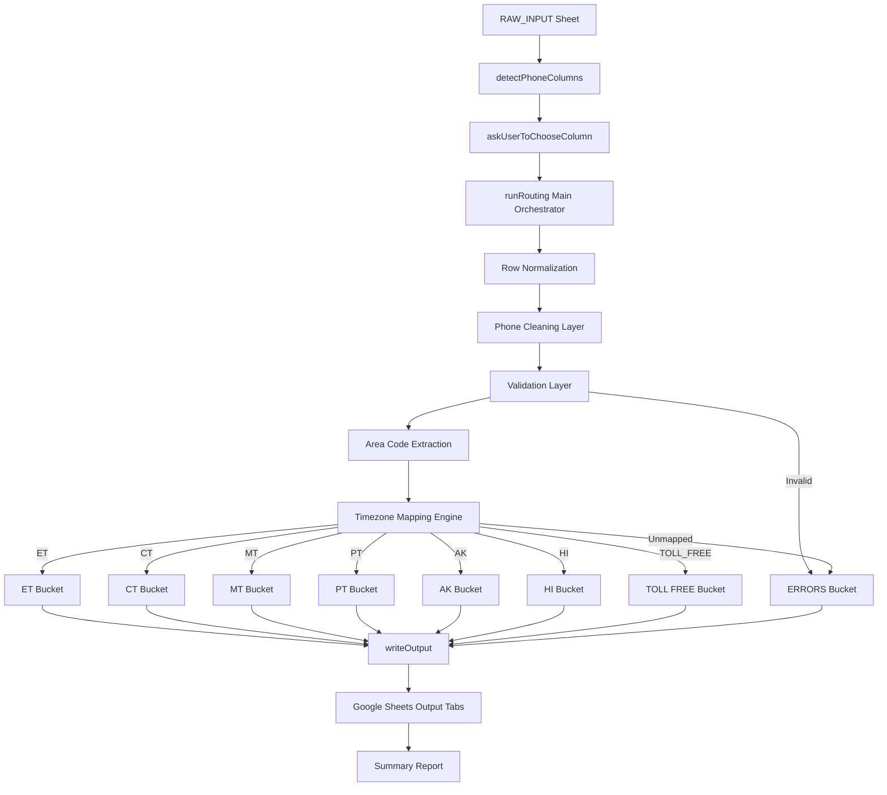

# 📘 Lead Router - Architecture

### 🧠 System at a glance

- Type: ETL Pipeline inside Google Sheets
- Input: Raw lead dataset
- Processing: Phone normalization + timezone mapping
- Output: Region-based structured lead sheets
- Complexity: O(n)

---

## 1. System Overview

Lead Router is a Google Apps Script-based data processing system that transforms raw lead datasets into **timezone-segmented, call-ready contact sheets**.

It operates entirely inside Google Sheets and performs:

- Phone number normalization
- Validation and cleaning
- Area code extraction
- Timezone classification
- Structured output generation

### Core Objective
Convert unstructured lead lists into **actionable, region-specific calling datasets in a single automated workflow.**

---

## 2. High-Level Architecture (full function inventory given below)

The system follows a simple **ETL-style pipeline (Extract → Transform → Load)**:

RAW_INPUT Sheet  
↓  
Column Detection + User Selection  
↓  
Phone Normalization Layer  
↓  
Validation Layer  
↓  
Area Code Extraction  
↓  
Timezone Mapping Engine  
↓  
Bucket Router (ET / CT / MT / PT / AK / HI / Toll-Free / Errors)  
↓  
Output Sheet Generator  

---

## 2.1 System Design Diagram

---
## 3. Core Components

### 3.1 UI Layer (`onOpen`)

Responsible for integrating the tool into Google Sheets UI.

**Responsibilities:**
- Adds custom menu: `Lead Router v2.5`
- Provides user entry points:
  - Run Routing
  - Reset Output

**Design Note:**
Ensures zero setup friction for end users.

---

### 3.2 Main Orchestrator (`runRouting`)

This is the central controller of the system.

**Responsibilities:**
- Loads input dataset
- Detects phone columns
- Collects user selection
- Initializes processing buckets
- Executes row-level processing pipeline
- Triggers output generation
- Displays summary report

**Design Pattern:**
Single-entry orchestration function (controller pattern)

---

## 4. Data Processing Pipeline

Each row passes through a deterministic transformation pipeline:

### Step 1: Row Normalization
Function: `normalizeRow()`

Ensures consistent indexing across malformed rows.

---

### Step 2: Phone Extraction & Cleaning
Functions:
- `extractExtension()`
- `cleanPhone()`

**Responsibilities:**
- Remove extensions (ext, x, extension)
- Strip non-numeric characters
- Normalize to 10-digit US format
- Handle country code `+1`

---

### Step 3: Validation Layer
Function: `validatePhone()`

Rules:
- Must not be blank
- Must be exactly 10 digits

Invalid records are routed to:

ERRORS bucket

---

### Step 4: Area Code Extraction
Function: `extractAreaCode()`

Extracts first 3 digits of cleaned number.

If invalid structure → Error bucket.

---

### Step 5: Timezone Mapping Engine
Function: `getTimeZone()`

Maps area codes to predefined timezone groups:

- ET (Eastern)
- CT (Central)
- MT (Mountain)
- PT (Pacific)
- AK (Alaska)
- HI (Hawaii)
- TOLL_FREE

If unmapped → Error bucket

---

### Step 6: Routing Engine

Each validated record is pushed into:

buckets[timezone]

Each row is enriched with:
- Clean phone number
- Extracted extension
- Assigned timezone

---

## 5. Output Layer

### Function: `writeOutput()`

Responsible for materializing processed data into Google Sheets.

### Behavior:
For each bucket:

- Create sheet if not exists
- Clear existing content if exists
- Write standardized headers
- Append processed rows

### Output Sheets Generated:
- ET
- CT
- MT
- PT
- AK
- HI
- TOLL_FREE
- ERRORS

---

## 6. Column Detection System

### Function: `detectPhoneColumns()`

Uses keyword scoring to identify likely phone fields.

### Matching Keywords:
- phone
- mobile
- cell
- contact
- work
- business
- number

### Output:
Returns ranked column candidates.

---

## 7. User Interaction Layer

### Function: `askUserToChooseColumn()`

Handles interactive selection of the correct phone column.

### Responsibilities:
- Displays detected column options
- Accepts user input
- Validates selection
- Returns column index

---

## 8. Reset System

### Function: `resetOutput()`

Removes all generated output sheets safely.

### Behavior:
- Checks for existing output sheets
- Prompts confirmation dialog
- Deletes or clears sheets depending on constraints

### Safety Design:
- Prevents accidental full spreadsheet destruction
- Ensures at least one sheet remains intact

---

## 9. Error Handling Strategy

Errors are captured at multiple stages:

| Stage        | Error Type                          |
|-------------|--------------------------------------|
| Validation   | BLANK_PHONE, INVALID_LENGTH_OR_FORMAT |
| Structure    | INVALID_AREA_CODE_STRUCTURE         |
| Mapping      | UNMAPPED_AREA_CODE                  |

All errors are stored in:

ERRORS sheet

---

## 10. Data Model

Each output row follows this structure:

[Original Columns...] + Clean Phone + Extension + Timezone

---

## 11. Performance Profile

- Algorithm Complexity: O(n) linear
- Observed End-to-End Performance:
  - ~11,000 records processed in ~25 seconds
  - Includes UI interaction + full execution pipeline

- Performance Characteristics:
  - Linear scaling with dataset size
  - Dominated by Google Apps Script runtime overhead and spreadsheet I/O
  - Efficient due to batch processing and in-memory transformations

- Bottleneck:
  Google Apps Script execution environment (not algorithm design)

---

## 12. Extensibility Design

The architecture is intentionally modular.

### Easy extensions include:

- 🌍 International number support
- 🧠 Duplicate detection layer
- 🚫 DNC filtering system
- 🔗 CRM integrations (HubSpot / Salesforce)
- 📊 Dashboard UI inside Sheets
- ⚡ Parallel processing optimization

---

## 13. Key Design Principles

- Deterministic processing (same input → same output)
- Loose coupling between stages
- Bucket-based classification model
- User-driven column selection
- Fail-safe error routing instead of crashes

---

## 14. Function Inventory (System Map)

This section provides a complete list of all functions in the system and their roles.

---

### 🔹 Entry Points (User-Facing)

| Function | Purpose |
|----------|--------|
| `onOpen()` | Creates custom Google Sheets menu for user interaction |
| `runRouting()` | Main execution engine for processing and routing leads |
| `resetOutput()` | Deletes or clears all generated output sheets |

---

### 🔹 Core Processing Engine

| Function | Purpose |
|----------|--------|
| `runRouting()` | Orchestrates full ETL pipeline |
| `writeOutput()` | Writes processed data into timezone-based sheets |

---

### 🔹 Phone Processing Layer

| Function | Purpose |
|----------|--------|
| `cleanPhone(phone)` | Removes formatting, extensions, and normalizes number |
| `extractExtension(phone)` | Extracts extension (ext/x/extension formats) |
| `validatePhone(phone)` | Ensures valid 10-digit number format |

---

### 🔹 Classification & Routing Layer

| Function | Purpose |
|----------|--------|
| `extractAreaCode(phone)` | Extracts first 3 digits (area code) |
| `getTimeZone(areaCode)` | Maps area code → timezone bucket |

---

### 🔹 Column Detection & UI Layer

| Function | Purpose |
|----------|--------|
| `detectPhoneColumns(headers)` | Identifies likely phone columns using keyword scoring |
| `askUserToChooseColumn(columns)` | Prompts user to select correct phone column |

---

### 🔹 Utility Layer

| Function | Purpose |
|----------|--------|
| `normalizeRow(row, length)` | Ensures row consistency by filling missing values |

---
## 15. Execution Flow (Runtime Sequence)

1. User opens Google Sheet
2. `onOpen()` creates UI menu
3. User clicks **Run Routing**
4. `runRouting()` starts execution

5. System loads `RAW_INPUT` sheet
6. `detectPhoneColumns()` scans headers
7. `askUserToChooseColumn()` gets user selection

8. For each row:
   - `normalizeRow()`
   - `extractExtension()`
   - `cleanPhone()`
   - `validatePhone()`
   - `extractAreaCode()`
   - `getTimeZone()`
   - Route into bucket

9. `writeOutput()` writes all buckets to sheets
10. Summary popup is displayed

---

## 16. Data Contract (Input → Output Schema)

### Input (RAW_INPUT)
- Any tabular dataset
- Must contain at least one phone-like column

### Selected Column
- User-selected phone field

### Internal Standardized Format
Each record is transformed into:

[Original Columns...] + Clean Phone + Extension + Timezone

### Output Buckets
Each bucket contains:

- Same base row structure
- Normalized 10-digit phone
- Extracted extension (if exists)
- Assigned timezone label

---

## 17. System Limitations

- Only supports North American Numbering Plan (NANP)
- Area-code-based timezone mapping (not GPS-based)
- Requires valid 10-digit numbers after cleaning
- Does not deduplicate leads
- Does not validate carrier or line type
- No external API enrichment

---

## 18. Data Safety & Privacy

- All processing happens inside Google Sheets
- No external APIs or data transmission
- No phone numbers are stored outside the spreadsheet
- Temporary variables exist only in script runtime memory

---

## 19. Versioning

Current Version: v2.5

### v2.5 Features
- Phone normalization engine
- Area-code-based routing
- Interactive column selection
- Multi-sheet output generation
- Error handling layer

### Planned (v3.0)
- Duplicate detection system
- DNC filtering
- CRM integration (HubSpot/Salesforce)
- International number support
- Performance optimization for 50k+ rows

---

## 20. Summary

Lead Router is a lightweight ETL engine built inside Google Sheets that:

- Normalizes raw phone data
- Classifies leads by geography (area-code-based)
- Produces structured, action-ready datasets
- Operates with zero external dependencies
